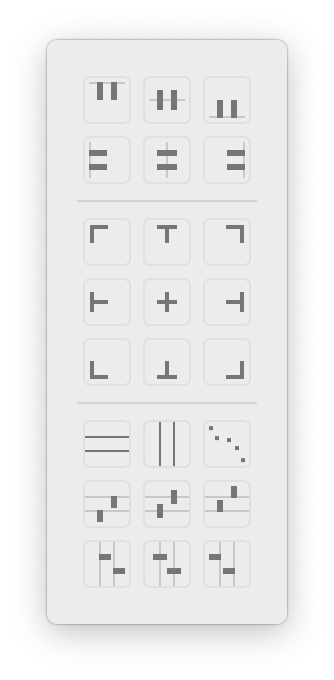
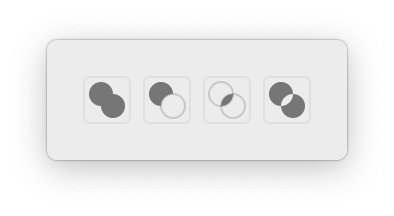
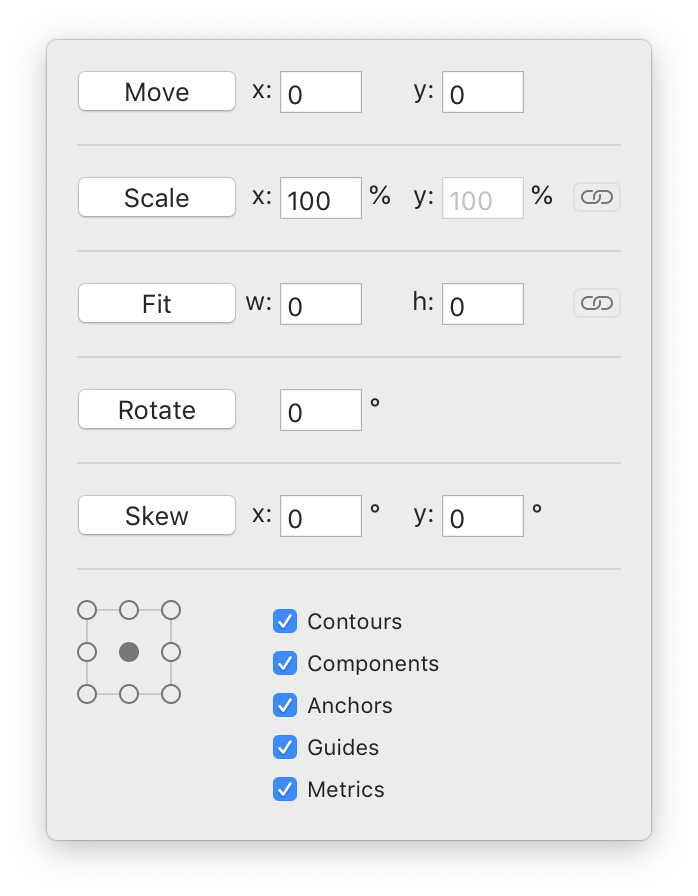

# Pop Up Tools

This extension provides commonly used tools that pop up in the glyph editor when you need them.

Tool                 | Hot Key
---------------------|----------
Align and Distribute | control-a
Boolean Operations   | control-o
Transform            | control-t

These try to be smart about doing stuff only to what you have selected.

## Align and Distribute

These align and distribute contours, points and stuff. There are lots of options. Hover over a button to see the tool tip if you don't know what the icon means.

## Boolean Operations

These do align, difference, intersection and xor operations on contours.

## Transform

These transform contours, points and stuff.